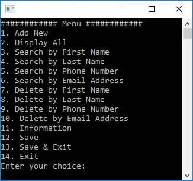
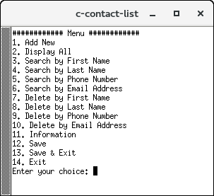

# C Contact List
A simple contact list application developed with C.

## [Download](https://github.com/yusufsefasezer/c-contact-list/archive/master.zip)

## How to compile

```sh
gcc array.c helper.c main.c
```

## Screenshot




# License
This project is licensed under the MIT License. See the [LICENSE](LICENSE) file for details

Created by [Yusuf Sezer](https://www.yusufsezer.com)
